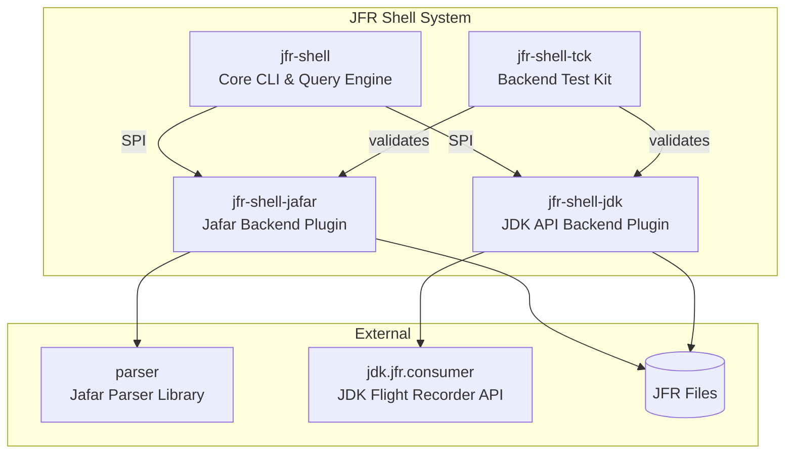
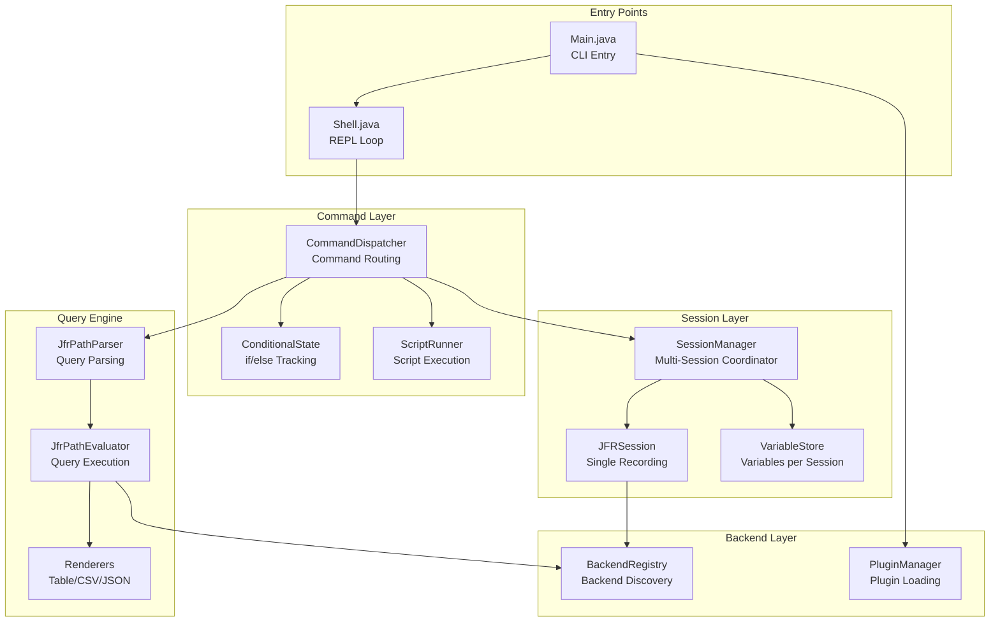
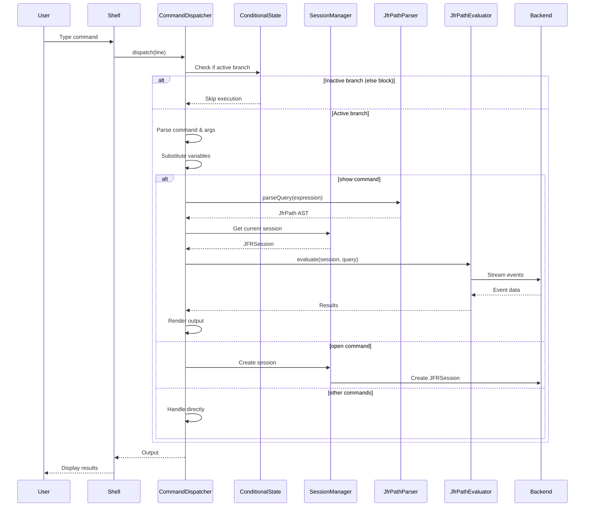
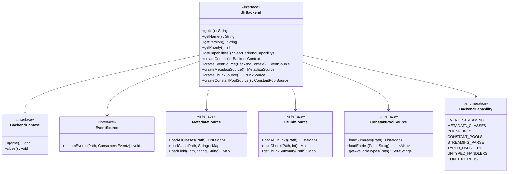
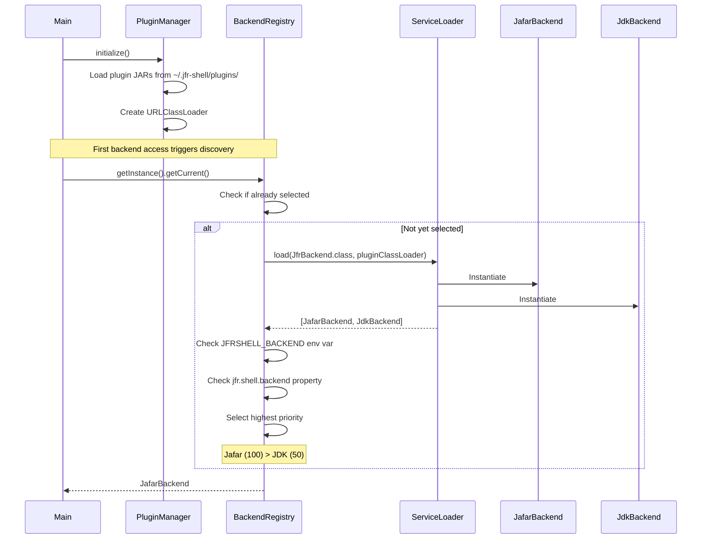
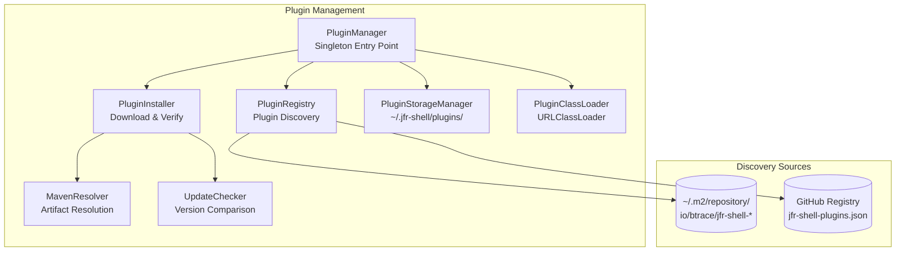
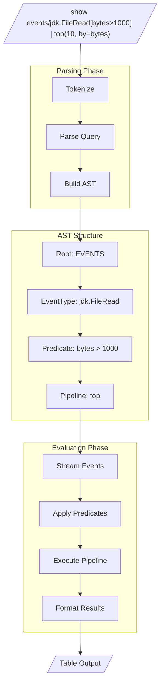
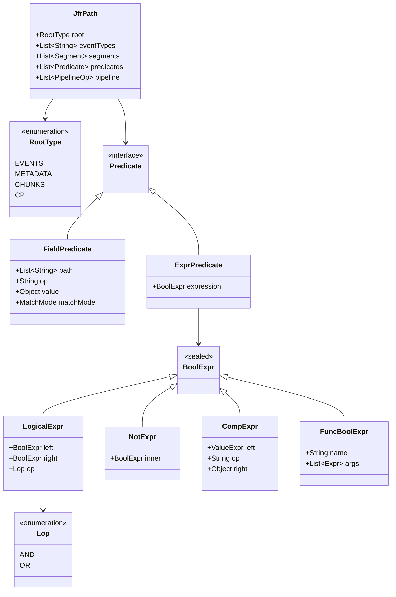
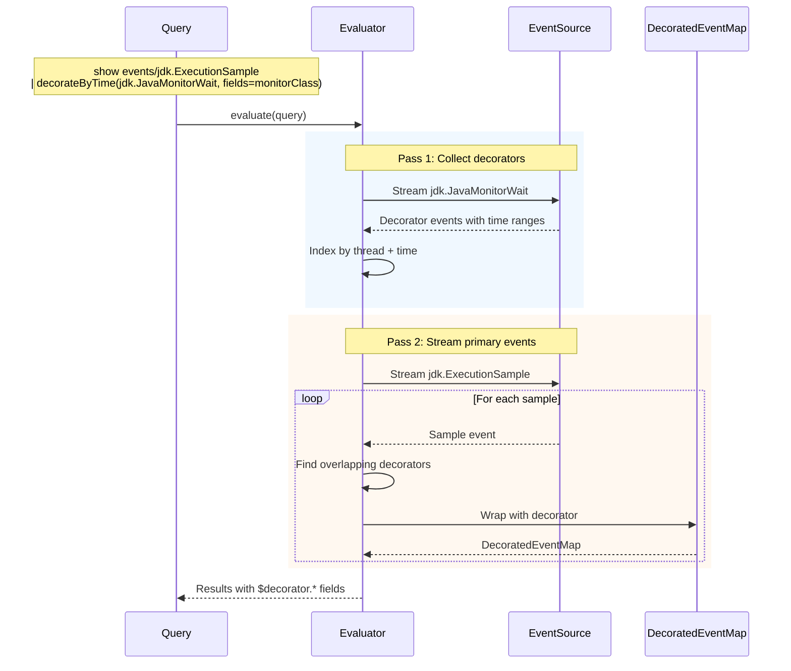
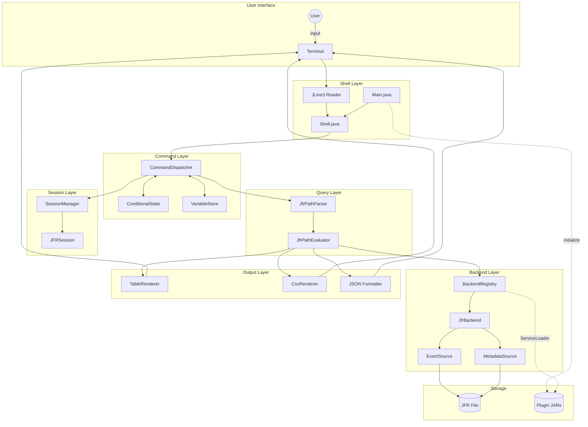

# JFR Shell Architecture

This document describes the internal architecture of JFR Shell, an interactive CLI for analyzing Java Flight Recorder files.

## System Overview

JFR Shell is organized into four modules with distinct responsibilities:



| Module | Purpose |
|--------|---------|
| `jfr-shell` | Core shell, command system, JfrPath query engine, plugin framework |
| `jfr-shell-jafar` | Backend using Jafar parser (full capabilities, priority 100) |
| `jfr-shell-jdk` | Backend using JDK API (limited capabilities, priority 50) |
| `jfr-shell-tck` | Technology Compatibility Kit for validating backends |

---

## Core Shell Architecture

### Component Overview



### Key Classes

| Class | Responsibility |
|-------|----------------|
| `Main` | CLI entry point (picocli), backend selection, plugin initialization |
| `Shell` | Interactive REPL using JLine3, history, command recording |
| `CommandDispatcher` | Routes commands to handlers, manages global state |
| `SessionManager` | Manages multiple open JFR files with aliases |
| `JFRSession` | Wraps TypedJafarParser, provides metadata and event access |
| `VariableStore` | Stores scalar, lazy query, and map variables |
| `ConditionalState` | Stack-based if/elif/else/endif tracking |

### Command Execution Flow



---

## Backend Plugin System

### SPI Interface Hierarchy



### Capability Matrix

| Capability | Description | Jafar | JDK |
|------------|-------------|:-----:|:---:|
| `EVENT_STREAMING` | Stream events from recordings | ✓ | ✓ |
| `METADATA_CLASSES` | Access event types and fields | ✓ | ✓ |
| `CHUNK_INFO` | Access chunk headers and offsets | ✓ | ✗ |
| `CONSTANT_POOLS` | Direct constant pool access | ✓ | ✗ |
| `STREAMING_PARSE` | Memory-efficient large file parsing | ✓ | ✓ |
| `TYPED_HANDLERS` | Compile-time typed interfaces | ✓ | ✗ |
| `UNTYPED_HANDLERS` | Map-based event access | ✓ | ✓ |
| `CONTEXT_REUSE` | Share context across sessions | ✓ | ✗ |

### Backend Discovery and Selection



### Plugin System Components



**Offline Installation**: For air-gapped environments, plugins can be installed from local JAR files:
```bash
java -jar jfr-shell.jar --install-plugin /path/to/plugin.jar
```
See [Backend Plugin Guide](Backends.md#offlineairgapped-installation) for details.

---

## JfrPath Query Engine

### Query Grammar

```
Query     := Root ['/' EventType] [Filters] [Pipeline]
Root      := 'events' | 'metadata' | 'chunks' | 'cp'
EventType := Identifier | '(' Identifier ('|' Identifier)* ')'
Filters   := '[' Predicate ']' ('[' Predicate ']')*
Pipeline  := '|' Operator ('|' Operator)*

Predicate := FieldPredicate | ExprPredicate
FieldPredicate := Path Op Literal [MatchMode]
ExprPredicate  := BoolExpr

BoolExpr  := AndExpr ('or' AndExpr)*
AndExpr   := NotExpr ('and' NotExpr)*
NotExpr   := 'not'? PrimaryBool
PrimaryBool := '(' BoolExpr ')' | FuncExpr | CompExpr
CompExpr  := ValueExpr Op Literal
```

### Query Processing Flow



### AST Node Types



### Pipeline Operators

| Category | Operators |
|----------|-----------|
| **Aggregation** | `count()`, `sum(path)`, `stats(path)`, `quantiles(...)`, `sketch(path)` |
| **Grouping** | `groupBy(key, agg=..., value=..., sortBy=..., asc=...)` |
| **Sorting** | `sortBy(field, asc=...)`, `top(n, by=..., asc=...)`, `asc`, `desc` |
| **Selection** | `select(field1, field2, expr as alias)` |
| **Decoration** | `decorateByTime(type, fields=...)`, `decorateByKey(type, key=..., fields=...)` |
| **Transform** | `tomap(keyField, valueField)`, `timerange(path, duration=...)` |

### Event Decoration



---

## Complete Data Flow



---

## Design Patterns

| Pattern | Usage |
|---------|-------|
| **Singleton** | `BackendRegistry`, `PluginManager` - single instances managing global state |
| **Factory** | `JfrBackend.createEventSource()` - backends create their own source implementations |
| **Strategy** | Output formats (Table/CSV/JSON) - interchangeable result formatting |
| **Adapter** | Providers (MetadataProvider, etc.) - adapt shell to backend APIs |
| **Flyweight** | `LazyQueryValue` - shared query results with weak references |
| **Command** | `CommandDispatcher` - encapsulates command execution |
| **Sealed Classes** | `Value`, `BoolExpr`, `ValueExpr` - exhaustive type hierarchies |

---

## Package Structure

```
jfr-shell/src/main/java/io/jafar/shell/
├── Main.java                    # CLI entry point
├── Shell.java                   # Interactive REPL
├── cli/
│   └── CommandDispatcher.java   # Command routing
├── backend/
│   ├── JfrBackend.java          # Backend SPI
│   ├── EventSource.java         # Event streaming
│   ├── MetadataSource.java      # Type metadata
│   ├── ChunkSource.java         # Chunk info
│   ├── ConstantPoolSource.java  # Constant pools
│   ├── BackendContext.java      # Resource sharing
│   ├── BackendCapability.java   # Capability enum
│   └── BackendRegistry.java     # Discovery & selection
├── plugin/
│   ├── PluginManager.java       # Plugin management
│   ├── PluginRegistry.java      # Plugin discovery
│   ├── PluginInstaller.java     # Installation
│   └── MavenResolver.java       # Maven resolution
├── jfrpath/
│   ├── JfrPath.java             # Query AST
│   ├── JfrPathParser.java       # Query parsing
│   └── JfrPathEvaluator.java    # Query execution
├── providers/
│   ├── MetadataProvider.java    # Metadata access
│   ├── ChunkProvider.java       # Chunk access
│   └── ConstantPoolProvider.java # CP access
├── core/
│   ├── SessionManager.java      # Multi-session coordinator
│   └── VariableStore.java       # Variable storage
└── JFRSession.java              # Single recording session
```

---

## See Also

- [JFR Shell Usage Guide](Usage.md)
- [JfrPath Query Language](JFRPath.md)
- [Backend Plugin Guide](Backends.md)
- [Backend Quickstart Tutorial](BackendQuickstart.md)
